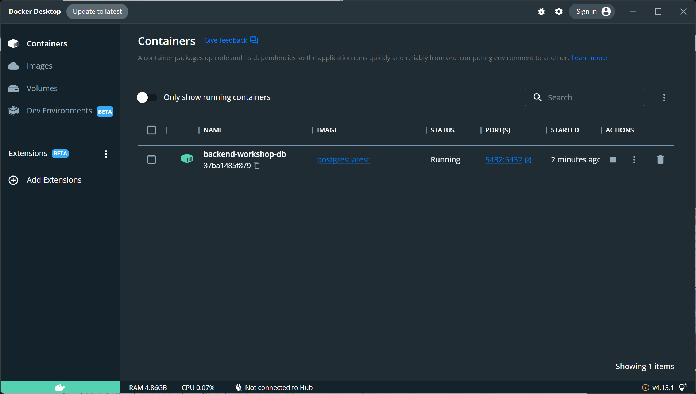

# Backend Development Workshop
Welcome to the backend development guide for the VOID Tech Org at the University of Michigan. Backend development is a broad term that encompasses a lot of different technologies. This guide will focus on the technologies that we recommend using for your projects, since we have experience with them and can help you out if you run into any issues.

## Disclaimer
This guide is not meant to be a comprehensive guide to each of the backend technologies we are going to mention, rather a quick introduction that will help you get started on your projects. You can use this guide as a reference, but you should also look at official documentation for more information. Check out the [Lean More](#resources) section for links to the official documentation.

## Prerequisites
This guide assumes you have basic programming fundamentals, such as variables, functions, loops, and classes. You should also have some familiarity with TypeScript. If you are not familiar with TypeScript feel free to go over our [TypeScript Overview](https://voidtechmichigan.org/react-workshop/#typescript-overview), or you can check out the [TypeScript Handbook](https://www.typescriptlang.org/docs/handbook/intro.html) for a quick introduction.

## Getting Started

Make sure you are in a Unix environment (Mac or Linux). If you are on Windows, you can use [WSL](https://docs.microsoft.com/en-us/windows/wsl/install-win10) ro run a Linux environment on your machine.

To get started you will need to download the starter files for the workshop and unpack them:

```console
$ pwd
/home/santiagomed/umich/void/workshops
$ mkdir backend-workshop
$ cd backend-workshop
$ wget https://voidtechmichigan.org/backend-workshop/starter_files.tar.gz
$ tar -xvzf starter_files.tar.gz
```

Move the starter files to your project directory and remove the original `starter_files/` directory and tarball.

```console
$ pwd
/home/santiagomed/umich/void/workshops/backend-workshop
$ mv starter_files/* .
$ rm -rf starter_files starter_files.tar.gz
```

Your project directory should now look like this:

```console
$ tree
.
├── package-lock.json
├── package.json
├── src
│   ├── app
│   │   ├── index.html
│   │   └── ts
│   │       ├── components
│   │       │   ├── App.tsx
│   │       │   ├── Cart.tsx
│   │       │   ├── Inventory.tsx
│   │       │   ├── ItemCard.tsx
│   │       │   ├── ItemFactory.tsx
│   │       │   ├── Login.tsx
│   │       │   ├── Market.tsx
│   │       │   └── Register.tsx
│   │       ├── index.tsx
│   │       └── utils
│   │           ├── api.ts
│   │           ├── auth.tsx
│   │           └── types.ts
│   └── server
│       ├── api
│       │   ├── controller
│       │   │   ├── auth.controller.ts
│       │   │   └── items.controller.ts
│       │   ├── index.ts
│       │   ├── middleware.ts
│       │   └── routes
│       │       ├── auth.routes.ts
│       │       └── items.routes.ts
│       ├── index.ts
│       └── models
│           ├── db.ts
│           ├── index.ts
│           ├── item.repository.ts
│           ├── models.ts
│           └── user.repository.ts
└── tsconfig.json
```

## Installation

If you already have Node.js installed from the React Workshop, you can skip this step.

Once you have downloaded the starter files, you will need to install Node.js and the dependencies for the project.

If you already have Node.js, make sure you have the latest stable version. You can check your version by running `node -v`. If you don't have Node.js, you can download it from [here](https://nodejs.org/en/download/) or with Node Version Manager (nvm).

```console
# Install nvm
$ wget wget -qO- https://raw.githubusercontent.com/nvm-sh/nvm/v0.39.2/install.sh | bash
# Install Node.js
$ nvm install node
$ node -v
v18.12.0
```

Once you have Node.js installed, you can install the dependencies for the project.

```console
$ pwd
/home/santiagomed/umich/void/workshops/backend-workshop
$ npm ci
```

### Setting up the Database

We will be using PostgreSQL as our database.

```console
$ brew install postgresql # macOS
$ sudo apt-get install postgresql # Ubuntu/WSL

$ psql --version # Check that PostgreSQL is installed
psql (PostgreSQL) 13.4 # Your version may be different
```

To make all of our lives easier, we are going to run the database in a Docker container. This pretty much saves me the headache of headache of having to fix any errors you might run into when setting up the database (it can get quite complicated).

Docker is a containerization tool that allows you to run applications in a containerized environment. You can think of it as a virtual machine, but it is much lighter weight and more efficient. You can read more about Docker [here](https://www.docker.com/resources/what-container).

To install Docker, you can follow the instructions [here](https://docs.docker.com/get-docker/).

After you install Docker, you can run the database in a container. Make sure you have Docker open and running.

```console
$ docker --version
Docker version 20.10.17, build 100c701 # Your version may be different
$ docker run --name backend-workshop-db -e POSTGRES_PASSWORD=void -p 5432:5432 -d postgres
```

You can check the Docker client to see if the container is running. You should see a container named `backend-workshop-db` running.




## Running the Project

Once you installed the dependencies, you can run the project.
  
```console  
$ npm start

> backend-workshop@1.0.0 start
> concurrently "npm run server" "npm run client"

[1] 
[1] > backend-workshop@1.0.0 client
[1] > parcel src/app/index.html
[1] 
[0] 
[0] > backend-workshop@1.0.0 server
[0] > nodemon --exec ts-node src/server/index.ts
[0] 
[0] [nodemon] 2.0.20
[0] [nodemon] to restart at any time, enter `rs`
[0] [nodemon] watching path(s): *.*
[0] [nodemon] watching extensions: ts,json
[0] [nodemon] starting `ts-node src/server/index.ts`
[0] Listening on port 3001. Visit http://localhost:3001/api
[1] Server running at http://localhost:3000
[1] Building...
[1] Bundling...
[1] Packaging & Optimizing...
[1] ✨ Built in 799ms
```

You can now visit http://localhost:3000 to see the app running; you will see a login page but it won't actually work. You can also visit http://localhost:3001/api to see the API's index route which returns the available routes.

## Backend Development Overview
Backend development is the process of building the server-side of an application. This includes the API that the frontend will use to communicate with the server, and the database that will store the data for the application. The backend is responsible for handling all of the business logic for the application, and the frontend is responsible for displaying the data to the user.

In this guide we are going to be using some popular technologies of backend development. We will be using [Node.js](https://nodejs.org/en/) as our runtime environment, [Express](https://expressjs.com/) as our web framework, and [PostgreSQL](https://www.postgresql.org/) as our database. We will also be using [Sequelize](https://sequelize.org/) as our ORM (Object Relational Mapper) to help us interact with the database.

Let's break down what each of these technologies are and what they do.

#### Node.js
Node.js is a runtime environment for JavaScript. It allows us to run JavaScript outside of the browser. Node.js is built on top of the [V8 JavaScript Engine](https://v8.dev/), which is the same engine that powers Google Chrome. Node.js is a great tool for building backend applications because it is fast, lightweight, and asynchronous. Instead of JavaScript, we are going to be using TypeScript, which is a superset of JavaScript that adds static typing and other features.

#### Express
Express is a web framework for Node.js. It is a minimal and flexible Node.js web application framework that provides a robust set of features for web and mobile applications. Express is a great tool for building backend applications because it is fast and minimalist. The downside to Express is that it is not very opinionated, which means that it doesn't come with a lot of features out of the box. This can be a good thing because it gives you a lot of flexibility, but it can also be a bad thing because we have to use other libraries to get some of the features that we want.

#### PostgreSQL
PostgreSQL is a relational database management system (RDBMS). Relational databases store data in tables, which are made up of rows and columns. Each row represents a single record, and each column represents a single attribute of the record. They are relational because they can be related to other tables through the use of keys, which are attributes that are unique to each record. This allows us to relate data from one table to another. For example, if we have a table of users, and a table of posts, we can relate the users to the posts by using the user's ID as a key in the posts table. This allows us to get all of the posts for a specific user.

#### Sequelize
Sequelize is an ORM for Node.js. An ORM is a tool that allows us to interact with a database using an object-oriented paradigm. This means that we can use classes and objects to interact with the database, instead of having to write SQL queries.

### Types of Backend Applications

#### REST API Oriented Server
A REST API server is an application that exposes a set of endpoints that can be used to perform CRUD (Create, Read, Update, Delete) operations on a database. By building a server purely composed of REST APIs, we can build a backend that can be used by multiple frontend applications, or a mobile application. If our web app uses this type of server, it has to be a single page application, because the server doesn't know anything about the frontend. This means that the frontend has to handle all of the routing and state management, while the server only has to handle the API calls.

#### Server-Side Rendering
Server-side rendering is a technique where the server sends the HTML for a page to the client, instead of the client rendering the HTML. Both routing and any internal APIs will be handled by the server; the client will only be responsible for displaying the data and using JavaScript to create any dynamic behavior. This is a good option if you want to build a website that is SEO friendly, or if you want to build a website that is fast and responsive.

### Debugging and Testing

Testing and debugging the backend is a bit different than the frontend. The backend is a lot more complex, and it is harder to test in the sense that there is no UI to see and test your changes. For APIs we can use tools like [Postman](https://www.postman.com/) to test our endpoints. For database testing we are going to be using the integrated Docker database console. We can also use the [pgAdmin](https://www.pgadmin.org/) tool to interact with the database.

Please install both Postman and pgAdmin using the following links:

[Postman](https://www.postman.com/downloads/)

[pgAdmin](https://www.pgadmin.org/download/)

## Model-View-Controller Architecture Pattern

The Model-View-Controller (MVC) design pattern is a software design pattern that separates the application into three main components: the model, the view, and the controller. The model is responsible for handling the data of the application (database). The view is responsible for displaying the data to the user. The controller is responsible for handling the user input and updating the model and view.


In our case, our view is isolated to the frontend, so we only need to worry about the model and the controller. The model deals with anything and everything related to the database. This includes the database schema, the database migrations, and the database models. The controller deals with anything and everything related to the API business logic. This includes the API routes, the API controllers, and the API services.

This is useful because it allows us to separate our concerns. The model is responsible for handling the database, and the controller is responsible for handling the API. This creates a certain level of abstraction, which allows us to change the database without having to change the API, and vice versa. This also allows us to test the API without having to worry about the database, and vice versa. Gosh I love abstraction.

## Setting Up our Express Server
At the beginning of this guide, you should have completed the setup for the project. If you haven't, go back and complete the [Getting Started](#getting-started) section. There's a lot of files in the project, and we'll go over each of them throughout the guide. For now, let's focus on the `server/index.ts` file.

```typescript
import express from "express";
import router from "./api";
import dotenv from "dotenv";
import cors from "cors";

// Load environment variables
dotenv.config();

// Set our port
const PORT = process.env.PORT;

// Create Express server
const app = express();

// Enable CORS: Cross Origin Resource Sharing
// This essentially allows us to make requests from our frontend to our backend
app.use(cors());

// Tell our app to use JSON
// This allows us to send JSON data to our backend
app.use(express.json());

// Tell our app to use the router we created
app.use("/api", router);

// Start the server
app.listen(PORT, () => {
  console.log(`Listening on port ${PORT}. Visit http://localhost:${PORT}/api`);
});
```
This is the entry point for our server. This is where we will configure our server and start it. In my experience, the most important line is `const app = express();`. This line creates an instance of the Express server. We can then use this instance to configure our server and start it. We don't care about the details of how Express works, we just need to know how to use it (Procedural Abstraction FTW!). The rest of the code is just configuration for our server. For example, we are telling our server to use JSON, and we are telling our server to use the router we created. We will go over the router later in the guide.

### Environment Variables
Environment variables allow us to store sensitive information like our database credentials. This is a good practice because it allows us to keep our sensitive information out of our codebase, and it allows us to change our environment variables without having to redeploy our application. We can create a `.env` file in the root of our project and add our environment variables there. We can then access these variables using `process.env.VARIABLE_NAME`. For example, we can access our port using `process.env.PORT`.

Sample `.env` file:
```
# Database Config Environment Variables
DB_NAME=postgres
DB_USER=postgres
DB_PASSWORD=void
DB_HOST=localhost

# Auth Config Environment Variables
TOKEN_SECRET='FILL_ME_IN'

# The port on which the application will run
PORT=3000
SERVER_PORT=3001
```

In case you are wondering what is the `TOKEN_SECRET` environment variable and where it is used, we will be using it later in the guide when we implement authentication.

## Database Setup

The good thing about Sequelize is that it deals with the database stuff for us. The bad thing is that we have to learn the Sequelize API. Your best friend here is the [Sequelize documentation](https://sequelize.org/master/). I highly recommend that you read through the documentation and get familiar with the API. It will make your life a lot easier. The [TypeScript section](https://sequelize.org/docs/v6/other-topics/typescript/) is especially helpful.

Let's look at the `server/model/db.ts` file.

```typescript
import dotenv from "dotenv";
import { Sequelize } from "sequelize";

dotenv.config();

const dbName = process.env.DB_NAME;
const user = process.env.DB_USER;
const password = process.env.DB_PASSWORD;
const host = process.env.DB_HOST;

/** @desc Create a new Sequelize instance */
const sequelize = new Sequelize(
  `postgres://${user}:${password}@${host}:5432/${dbName}`
);

/** @desc Test connection to database */
sequelize
  .authenticate()
  .then(() => {
    console.log("Connection has been established successfully.");
  })
  .catch((err: any) => {
    console.error("Unable to connect to the database:", err);
  });

export default sequelize;
```
Here we are setting up our database connection. We are using the `dotenv` package to load our environment variables. We are then using the `Sequelize` class to create a new instance of the Sequelize database. We are then testing the connection to the database. If the connection is successful, we will see the `Connection has been established successfully.` message in the console. If the connection fails, we will see the `Unable to connect to the database:` message in the console. Finally, we are exporting the `sequelize` instance so that we can use it in other files.

### Database Models

For our small project, we are going to have two main models. The first model is the `User` model, and the second model is the `Item` model. The `User` model will be responsible for handling the user data, and the `Item` model will be responsible for handling the item data.

Since we setup our database connection earlier, we can start creating our database models. Let's look at the `server/model/models.ts` file.

```typescript
import sequelize from "./db";
import {
  Model,
  DataTypes,
  InferAttributes,
  InferCreationAttributes,
  CreationOptional,
  NonAttribute,
  Association,
  ForeignKey,
} from "sequelize";

/** @desc Initialize User model */
export class User extends Model<
  InferAttributes<User, { omit: "items" }>,
  InferCreationAttributes<User, { omit: "items" }>
> {
  declare username: string;
  declare email: string;
  declare password: string;

  declare createdAt: CreationOptional<Date>;
  declare updatedAt: CreationOptional<Date>;

  get userName(): NonAttribute<string> {
    return this.username;
  }

  declare items?: NonAttribute<Item[]>;

  declare static associations: { items: Association<User, Item> };
}

/** @desc Initialize Item model */
export class Item extends Model<
  InferAttributes<Item>,
  InferCreationAttributes<Item>
> {
  declare id: CreationOptional<number>;
  declare name: string;
  declare price: number;
  declare calories: number;
  declare userId: ForeignKey<User["username"]>;
  declare owner?: NonAttribute<User>;
}

User.init(
  {
    username: {
      type: DataTypes.STRING,
      primaryKey: true,
    },
    password: {
      type: DataTypes.STRING,
      allowNull: false,
    },
    email: {
      type: DataTypes.STRING,
      allowNull: false,
    },
    createdAt: {
      type: DataTypes.DATE,
      allowNull: false,
    },
    updatedAt: {
      type: DataTypes.DATE,
      allowNull: false,
    },
  },
  {
    sequelize,
    modelName: "User",
    tableName: "users",
  }
);

Item.init(
  {
    id: {
      type: DataTypes.INTEGER,
      autoIncrement: true,
      primaryKey: true,
    },
    name: {
      type: DataTypes.STRING,
      allowNull: false,
    },
    price: {
      type: DataTypes.FLOAT,
      allowNull: false,
    },
    calories: {
      type: DataTypes.INTEGER,
      allowNull: false,
    },
  },
  {
    sequelize,
    modelName: "Item",
    tableName: "items",
    createdAt: false,
    updatedAt: false,
  }
);

User.hasMany(Item, {
  foreignKey: "userId",
  sourceKey: "username",
  as: "items",
});

Item.belongsTo(User, {
  targetKey: "username",
});
```

This is a lot of lines, but I feel it's pretty straightforward. Think of this file as the **schema** of our database. You can think of the `User` model as the `users` table, and you can think of the `Item` model as the `items` table. In the class declaration, we are defining the attributes of the model. Then, we are using the Sequelize `init` method to initialize the model. The `init` method takes two arguments. The first argument is an object that defines the attributes of the model. The second argument is an object that defines the options of the model. Note how we pass `sequelize` as the first argument to the `init` method. This is how we tell Sequelize that we want to use the `sequelize` instance that we created earlier.

There is other stuff here like `CreationOptional` which sets that attribute to be optional when creating a new instance of the model. There is also the `NonAttribute` which tells Sequelize that this attribute is not a database column. We are also using the `ForeignKey` type to define the foreign key relationship between the `User` model and the `Item` model. Finally, we are using the `hasMany` and `belongsTo` methods to define the relationship between the `User` model and the `Item` model. The `hasMany` method tells Sequelize that the `User` model has many `Item` models. The `belongsTo` method tells Sequelize that the `Item` model belongs to the `User` model.

### Database Repositories

Now that we have our database models, we can start creating our database repositories. The database repositories are responsible for handling the database operations. We are going to have two database repositories. The first database repository is for the `User` model, and the second database repository is for the `Item` model. Each of our files has a series of methods that will handle the database operations. I will go over one method from each file as an example.

Let's look inside the `server/model/user.repositoruy.ts` file.

```typescript
/**
 * @desc Create a new user
 * @param {User} user
 * @returns {Promise<User | boolean>} Created user or false if user already exists
 */
export const createUser = async (user: User): Promise<User | boolean> => {
  // Check if user already exists
  const userExists = await User.findOne({
    where: {
      username: user.username,
    },
  });
  if (userExists) {
    return false;
  }
  // Create user
  const newUser = await User.create(user);
  return newUser;
};
```

This method is responsible for creating a new user. The method takes a `User` object as an argument. The method checks if the user already exists in the database. If the user already exists, the method returns `false`. If the user does not exist, the method creates a new user and returns the new user.

Most of our methods are going to be pretty similar to this one, where we use the Sequelize API to perform the database operations. Let's look at the `server/model/item.repository.ts` file.

```typescript
/**
 * @desc Get all items
 * @returns {Promise<Item[]>} All items
 */
export const getItems = async (): Promise<Item[]> => {
  const items = await Item.findAll();
  return items;
};
```

This one is even more straightforward. This method is responsible for getting all the items from the database. The method uses the `findAll` method to get all the items from the database. The `findAll` method returns an array of `Item` objects.

### Putting it all together

Now that we have our database models and our database repositories, we can start using them in our application. To do this we need to export a `db` object from the `server/model/index.ts` file. The `db` object will contain access to our repositories as well as to our sequelize instance. This is what the `server/model/index.ts` file looks like.

```typescript
import { Sequelize } from "sequelize";
import sequelize from "./db";

import * as user from "./user.repository";
import * as item from "./item.repository";

sequelize.sync();

const db = {
  sequelize,
  Sequelize,
  user,
  item,
};

export default db;
```

The first thing we do is sync the database. This will create the tables in the database if they do not already exist. Then we export a `db` object that contains access to our repositories as well as to our sequelize instance.

## Controllers

Now that we have our database models and our database repositories, we can start creating our controllers. The controllers are responsible for handling the requests and responses. We are going to have two controllers. The first controller handles user authentication, and the second controller handles the CRUD operations for the items.

### Routes

The first thing we need to do is set up our index route. This is the route that will handle the requests to the `/` endpoint. This is what the `server/api/routes/index.ts` file looks like.

```typescript
import express from "express";
import authRouter from "./routes/auth.routes";
import itemsRouter from "./routes/items.routes";

const router = express.Router();

/** @route GET /api */
router.get("/", (req, res) => {
  res.send({
    items: "/api/items",
    auth: "/api/auth",
    url: req.originalUrl,
  });
});

router.use("/items", itemsRouter);
router.use("/auth", authRouter);

export default router;
```

This route is pretty straightforward. It just sends a response with the available routes. The `items` route is for the CRUD operations for the items, and the `auth` route is for user authentication.

See how we create a router using `express.Router()`. We then use the `router.get` method to handle the `GET` requests to the `/` endpoint. We then use the `router.use` method to handle the requests to the `/items` and `/auth` endpoints. The `router.use` method takes two arguments. The first argument is the path to the route, and the second argument is the router that will handle the requests to that route.

We also have a folder for our specific routes. These are are also straightforward. We have a `user.routes.ts` file and an `item.routes.ts` file. The `user.routes.ts` file contains the routes for the user authentication controller. The `item.routes.ts` file contains the routes for the item controller.

Here is items route file as an example.

```typescript
import express from "express";
import * as controller from "../controller/items.controller";
import { authenticateToken } from "../middleware";

const itemsRouter = express.Router();

/** @route GET /api/items */
itemsRouter.get("/", authenticateToken, controller.getItemsController);

/** @route POST /api/items */
itemsRouter.post("/", authenticateToken, controller.createItemController);

/** @route PUT /api/items/<id> */
itemsRouter.put("/:id", authenticateToken, controller.updateItemController);

/** @route DELETE /api/items/<id> */
itemsRouter.delete("/:id", authenticateToken, controller.deleteItemController);

export default itemsRouter;
```

Similar to the index file, we create a router using `express.Router()`. We then use the `router.get`, `router.post`, `router.put`, and `router.delete` methods to handle the `GET`, `POST`, `PUT`, and `DELETE` requests to the `/items` endpoint. The `:id` in the `router.put` and `router.delete` methods is a placeholder for the id of the item. The id can change for each request, so we need to use a placeholder.

Finally we export the router for our main router to use.

In case you are wondering what `authenticateToken` is, we will look at that later.

### Controller methods

Now that we have our routes set up, we can start creating our controller methods. The controller methods are responsible for handling the requests and responses.

Let's look at one of the functions in the `server/api/controller/items.controller.ts` file.

```typescript
import db from "../../models";

/**
 * @route GET /api/items
 * @desc Get all items
 * @param req Request
 * @param res Response
 * @returns {Promise<void>}
 */
export const getItemsController = async (req: any, res: any): Promise<void> => {
  if (req.query.username) {
    const username = req.query.username;
    const items = await db.user.getItems(username);
    return res.send({
      items: items,
      url: req.originalUrl,
    });
  }
  const items = await db.item.getItems();
  res.send({
    items: items,
    url: req.originalUrl,
  });
};
```

This function is responsible for handling the `GET` requests to the `/items` endpoint. The function checks if the request has a `username` query parameter. If it does, then it gets the items for that user. If it does not, then it gets all the items. A query parameter is a parameter that is passed to the request. For example, if we wanted to get the items for the user `john`, we would make a request to the `/items?username=john` endpoint. Note that we are also importing the `db` object from the `server/model/index.ts` file. This is how we can access our database repositories.

If you go back to our `items.routes.ts` file, you will see that we are importing our controller methods and passing them to the `router.get`, `router.post`, `router.put`, and `router.delete` methods. This is how we can use our controller methods to handle the requests.

Let's look at another controller method from the `server/api/controller/auth.controller.ts` file.

```typescript
/**
 * @desc Generate a JWT token
 * @param user
 * @returns {string} JWT token
 */
const generateAccessToken = (user: any): string => {
  return jwt.sign({ user: user }, process.env.TOKEN_SECRET as string, {
    expiresIn: "15m",
  });
};

/**
 * @route POST /api/auth/register
 * @desc Register a new user and return a JWT token
 * @access Public
 * @param {any} req
 * @param {any} res
 * @returns {Promise<void>}
 */
export const createUserController = async (
  req: any,
  res: any
): Promise<void> => {
  const user = req.body;
  const createdUser = await model.createUser(user);
  if (!createdUser) {
    return res.status(400).send({
      message: "User already exists",
    });
  }
  const token = generateAccessToken(user.username);
  res.send({
    createdUser: createdUser,
    token: token,
    url: req.originalUrl,
  });
};
```

This function is responsible for handling the `POST` requests to the `/auth/register` endpoint. The function creates a new user and returns a JWT token. The token is used for authentication. We will look at how this works in the next section.

## Authentication using JWT

Now that we have our routes and controller methods set up, we can start looking at how we can authenticate our users. We will be using JWT tokens for authentication. JWT stands for JSON Web Token. JWT tokens are used to verify that a user is who they say they are. JWT tokens are created using a secret key which is used to sign the token. The token is then sent to the user. When the user makes a request, they send the token with that request. The server then verifies the token using the secret key. If the token is valid, then the user is authenticated.

Let's generate a secret key and add it to our environment variables. We will be using the `crypto` package to generate the secret key.

In your console, run the following command.

```console
$ node -e "console.log(require('crypto').randomBytes(64).toString('hex'));"
# This will output a random string
```

Copy the output and add it to your `.env` file as the `TOKEN_SECRET` variable.

```console
TOKEN_SECRET=YOUR_RANDOM_STRING
```

Now that we have our secret key, we can start using it to create our JWT tokens. Let's look at the `generateAccessToken` function in the `server/api/controller/auth.controller.ts` file.

```typescript
/**
 * @desc Generate a JWT token
 * @param user
 * @returns {string} JWT token
 */
const generateAccessToken = (user: any): string => {
  return jwt.sign({ user: user }, process.env.TOKEN_SECRET as string, {
    expiresIn: "15m",
  });
};
```

This function takes in a user and returns a JWT token. The token is created using the `jwt.sign` method. The first parameter is the payload. The payload is the data that we want to store in the token. In this case, we are storing the user's username. The second parameter is the secret key. The third parameter is the options. We are setting the token to expire in 15 minutes. This means that after 15 minutes, the token will no longer be valid.

## Password hashing

The worst thing that can happen to a user is for their password to be compromised. This is why we need to hash our passwords. Hashing is a one-way function. This means that we can hash a password, but we cannot unhash it. This means that if someone gets a hold of our database, they will not be able to get the user's password.

To make this even more secure, we will be using a salt. A salt is a random string that is added to the password before it is hashed. This makes it even harder for someone to get the user's password. It especially protects against rainbow table attacks. You can read more about rainbow table attacks [here](https://en.wikipedia.org/wiki/Rainbow_table).

We hash our passwords using middleware.

## Middleware

Now that we have our JWT tokens, we can start using them to authenticate our users. We will be using middleware to authenticate our users or hash their passwords. Middleware is a function that has access to the request and response objects, modify the request and response objects, and end the request-response cycle.

Let's take a look at our `server/api/middleware.ts` file.

```typescript
import bcrypt from "bcrypt";
import jwt from "jsonwebtoken";

/**
 * @desc Hash a password
 * @param req Request
 * @param res Response
 * @param next Next
 * @returns {Promise<void>}
 */
export const hashPassword = async (
  req: any,
  res: any,
  next: any
): Promise<void> => {
  const salt = await bcrypt.genSalt(10);
  const hashedPassword = await bcrypt.hash(req.body.password, salt);
  console.log(hashedPassword);
  req.body.password = hashedPassword;
  next();
};

/**
 * @desc Authenticate a JWT token
 * @param req Request
 * @param res Response
 * @param next Next
 */
export const authenticateToken = (req: any, res: any, next: any) => {
  const authHeader = req.headers["authorization"];
  const token = authHeader && authHeader.split(" ")[1];
  if (token == null) return res.sendStatus(401);

  jwt.verify(
    token,
    process.env.TOKEN_SECRET as string,
    (err: any, user: any) => {
      if (err) return res.sendStatus(403);
      req.user = user;
      next();
    }
  );
};
```

In this file, we are exporting two functions. The first function is the `hashPassword` function. This function hashes the password that is sent in the request body. The second function is the `authenticateToken` function. This function verifies the JWT token that is sent in the request header. If the token is valid, then the user is authenticated. If the token is not valid, then the user is not authenticated.

To hash a password, we use the `bcrypt.hash` method. The first parameter is the password that we want to hash. The second parameter is the salt. The salt is generated using the `bcrypt.genSalt` method which takes in a number. This number is the number of rounds that the salt will be generated for. The higher the number, the more secure the salt will be. But also, the higher the number, the longer it will take to generate the salt. Ten rounds is a good number to use. We then use bcrypt to hash the password and the salt. The hashed password is then stored in the request body. We can now safely assume that the password we are going to store in the database is the hashed password.

### Using Middleware

Now that we have our middleware, we can start using it. To use it, we pass in the function as a parameter to the route. Let's look at the `server/api/routes/auth.route.ts` file.

```typescript
import express from "express";
import * as controller from "../controller/auth.controller";
import { hashPassword } from "../middleware";

const authRouter = express.Router();

/** @route POST /api/auth/signup */
authRouter.post("/signup", hashPassword, controller.createUserController);

/** @route POST /api/auth/login */
authRouter.post("/login", controller.loginController);

export default authRouter;
```

In this file, we are importing the `hashPassword` function from the `server/api/middleware.ts` file. We then pass it as a parameter to the `POST /api/auth/signup` route. This means that before the `createUserController` function is called, the `hashPassword` function will be called. This means that when the request gets to the controller, the password will already be hashed.

## Try it Out!

The solution is in the Github repository. You can also clone the repository and run the following commands to get the project up and running.

```console
$ cd solution
$ npm ci
# Make sure the database is running on Docker or start up a new one if it is not
$ docker run --name backend-workshop-db -e POSTGRES_PASSWORD=void -p 5432:5432 -d postgres
$ npm start
```

The frontend is already built for you, so you just have to go to `localhost:3000` to see the app. Go create an account and try logging in. You can also try logging in with an incorrect password to see the error message.

## Final Notes

I know that this tutorial was a lot to take in. But I hope that you learned something new. I highly recommend giving it a second read. This will help you understand the concepts better and make connections between the different parts of the code. If you have any questions, feel free to reach out! I would love to help you out.

## Resources

- [Node.js](https://nodejs.org/en/)
- [Express](https://expressjs.com/)
- [PostgreSQL](https://www.postgresql.org/)
- [Sequelize](https://sequelize.org/)
- [REST API](https://restfulapi.net/)
- [Server-Side Rendering](https://en.wikipedia.org/wiki/Server-side_rendering)
- [Postman](https://www.postman.com/)
- [pgAdmin](https://www.pgadmin.org/)
- [Docker](https://www.docker.com/)


## Acknowledgements

This guide was written by [Santiago Medina](https://github.com/santiagomed) for VOID Tech.